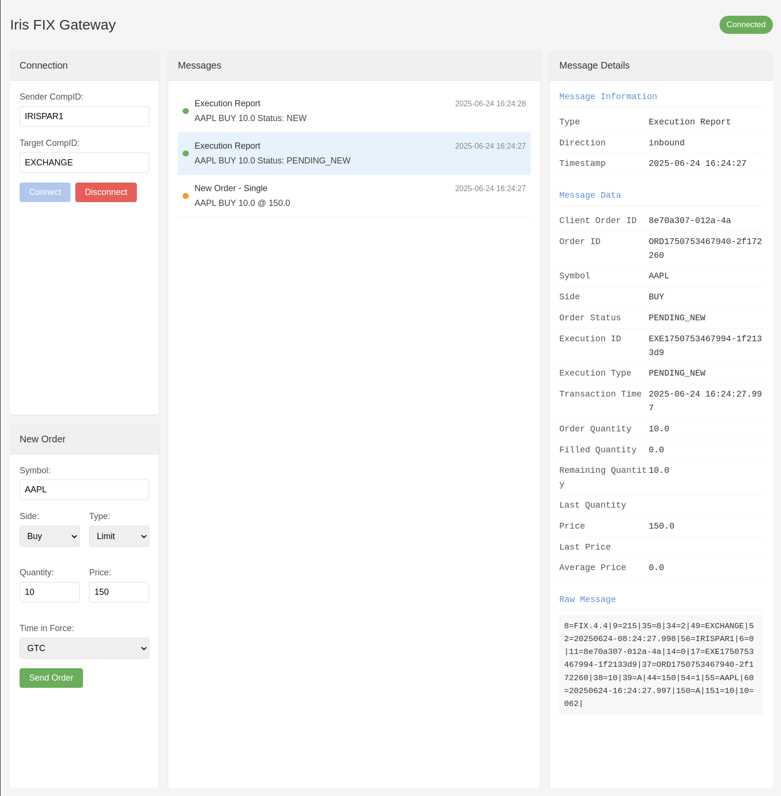
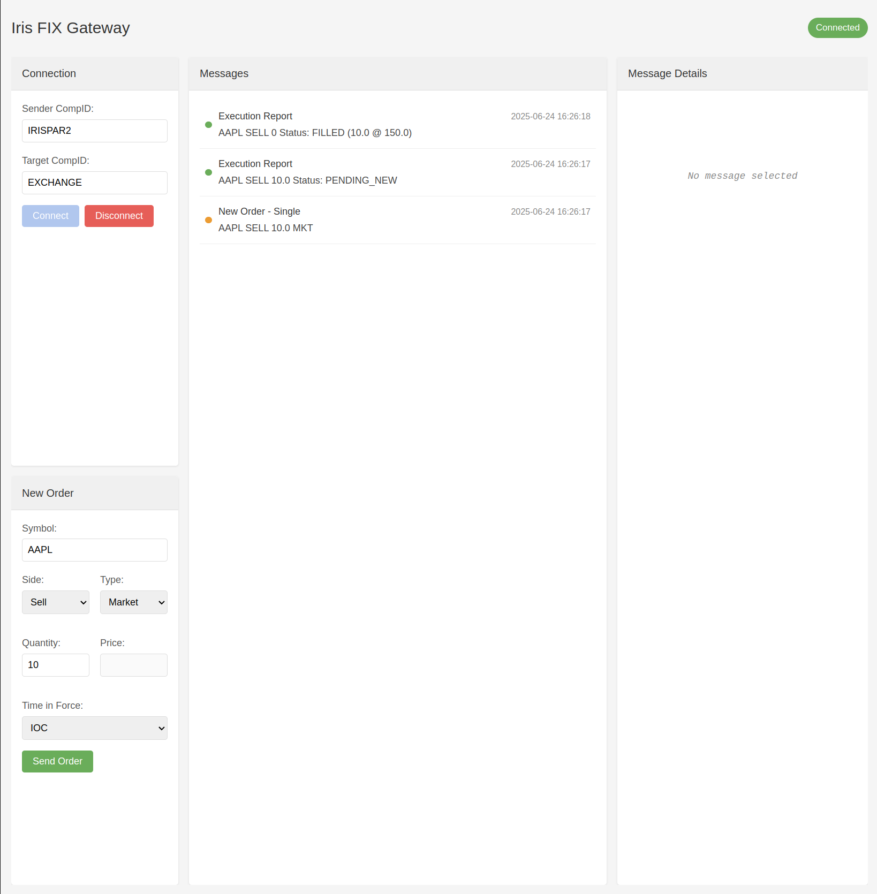
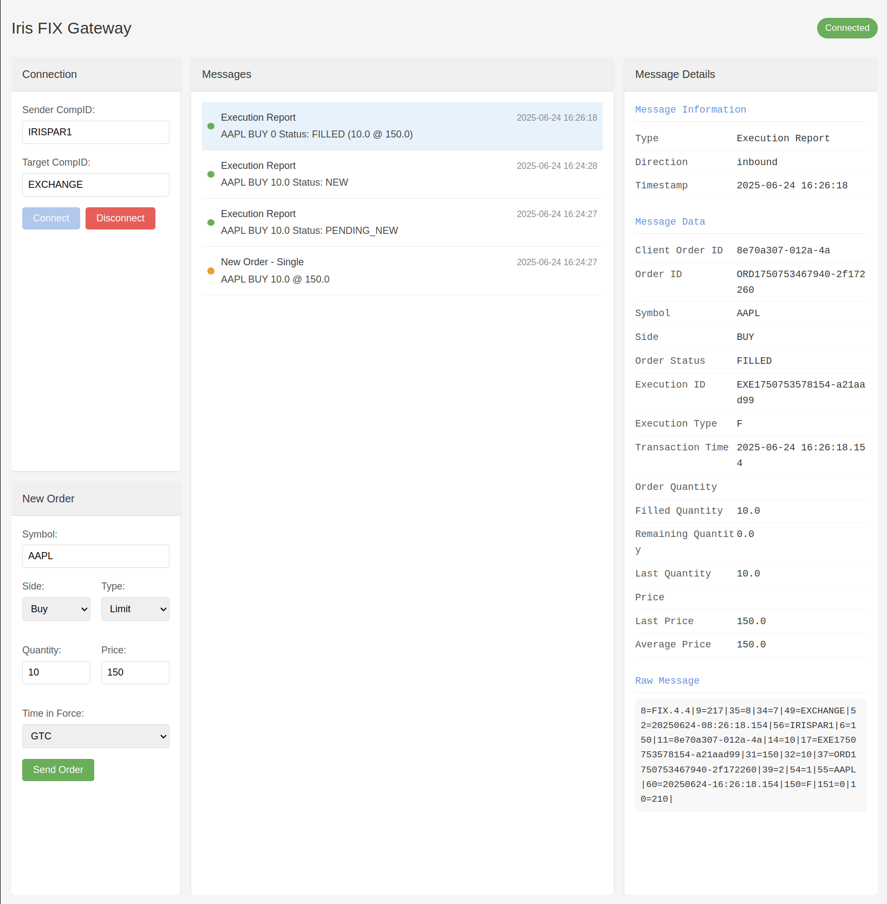

# IRIS Trading Platform

IRIS is a high-performance trading platform that provides matching engine, order management, and market data distribution capabilities. The platform is built using Java Spring Boot for the server components and Python for the test client.

## Trading Example

The following example demonstrates order matching between two FIX clients (IRISPAR1 and IRISPAR2) trading AAPL:

<table>
<tr>
    <td width="50%">
        <strong>Step 1: IRISPAR1 Sends Limit Order</strong><br/>
        
    </td>
    <td width="50%">
        <strong>Step 2: IRISPAR2 Sends Market Order</strong><br/>
        
    </td>
</tr>
<tr>
    <td colspan="2" align="center">
        <strong>Step 3: Order Matched and Filled</strong><br/>
        
    </td>
</tr>
</table>

Flow:
- IRISPAR1: BUY LIMIT order (10 AAPL @ 150.0 GTC)
- IRISPAR2: SELL MARKET order (10 AAPL IOC)
- Final execution: Complete fill at 150.0

Features:
- Order entry through FIX protocol
- Different order types (Limit vs Market)
- Different time in force instructions (GTC vs IOC)
- Real-time order matching
- Execution reporting via FIX messages

## System Architecture

### Components

- **App Server** (`iris_appserver`): FIX gateway and order entry point
- **Matching Engine** (`iris_matchingengine`): Core order matching system
- **Exchange Operations** (`iris_exchangeoperations`): Exchange management and administrative operations
- **Test Client** (`iris_testclient`): Python-based FIX client for testing

### Technology Stack

- **Backend**:
    - Java 17
    - Spring Boot
    - QuickFIX/J
    - PostgreSQL 
    - Maven

- **Test Client**:
    - Python 
    - Flask
    - Socket.IO
    - HTML
  
- **Message Queue**:
    - Kafka  

- **Automation**:
    - Ansible playbooks
    - Rundeck

## Getting Started

### Prerequisites

```bash
# Install Java 17
sudo apt install openjdk-17-jdk

# Install PostgreSQL
sudo apt install postgresql-15

# Install Python dependencies
cd iris_testclient
pip install -r requirements.txt
```

## Project Structure

```
iris/
├── iris_appserver/          # FIX gateway and order entry
├── iris_matchingengine/     # Core matching engine
├── iris_exchangeoperations/ # Admin operations
├── iris_testclient/        # Python test client
└── common/                 # Shared models and utilities
```

### Configuration

1. Application Properties (`application.properties`):

```properties
# Database
spring.datasource.url=jdbc:postgresql://localhost:5432/iris
spring.datasource.username=iris_user
spring.datasource.password=your_password

# Server ports
appserver.port=8081
matchingengine.port=8080
exchangeoperations.port=8082

# FIX configuration
fix.sendercompid=EXCHANGE
fix.targetcompid=CLIENT
fix.version=FIX.4.4
```

2. FIX Dictionary (`FIX44.xml`):
- Located in `src/main/resources/`
- Standard FIX 4.4 specification with custom fields

### Building

```bash
# Build entire project
mvn clean install

# Start Components in sequence
java -jar iris_exchangeoperations/target/iris-exchangeoperations.jar
java -jar iris_matchingengine/target/iris-matchingengine.jar
java -jar iris_appserver/target/iris-appserver.jar
```

### Running the Test Client

Run multiple test clients on different ports to use multiple FIX sessions to trade with each other.
```bash
cd iris_testclient
python app.py --port {port_number}
```


### Exchange Configuration

The platform uses several configuration files located in `src/main/resources/`    
Restart the exchange services in sequence after any configuration changes.

1. **Session Configuration**
```csv
# sessions.csv
# Format: Name,FIXSenderCompId,ClearingAccount
Participant_1,IRISPAR1,CLR1
Participant_2,IRISPAR2,CLR2
Participant_3,IRISPAR3,CLR3
```

2. **Instrument Configuration**
```csv
# instruments.csv
# Format: Symbol,LastSettlementPrice,VolumeTickSize,TradingHours
AAPL,150.56,1,0000-2359
MSFT,250.34,1,0000-2359
GOOGL,2750.45,1,0000-2359
AMZN,3300.20,1,0000-2359
TSLA,875.76,1,0000-2359
INVA,10000,1,0000-2359
K,82,1,0000-2359
ITCI,20,1,0000-2359,
PRAT,10000,1,0000-2359
```
3. **FIX Configuration**
```properties
# quickfixj.cfg
[default]
ConnectionType=acceptor
StartTime=00:00:00
EndTime=23:59:59
HeartBtInt=30
FileStorePath=target/fix/store
FileLogPath=target/fix/log
UseDataDictionary=Y
DataDictionary=FIX44.xml

[session]
BeginString=FIX.4.4
SenderCompID=EXCHANGE
TargetCompID=
SocketAcceptPort=9876
```

## Features

### Current Features
- FIX protocol support (4.4)
- Order management
- Basic matching engine
- Instrument management
- Session management


## Database Schema

Persistence implementation is in progress. The initial schema includes:
- `orders`: Stores order details
- `trades`: Records executed trades
- `orderbook`: Holds real-time market data
- `settlement_prices`: Contains settlement prices for instruments
- `reference_prices`: Stores reference prices for instruments
- `exchange_config`: Stores exchange services configurations
- `risk_management`: Contains risk parameters and limits
- `fix_sessions`: Manages FIX session
- `instruments`: Defines trading instruments
- `fix_messages`: Logs incoming and outgoing FIX messages

### In Development
1. **Persistence Layer** (High Priority)
    - Trading data
    - Configuration data
    - Exchange data
    - Participant data
   
8. **Market Data Distribution** (High Priority)
    - Real-time order book updates
    - Trade data dissemination
    - Market statistics
    - Trading status updates
   
2. **Exchange management dashboard** (High Priority)
    - Centralized dashboard for monitoring and managing exchanges
    - Ansible playbooks for deployment and configuration
    - Rundeck jobs for automated tasks

3. **Risk Management** (High Priority)
    - Position limits
    - Order validation
    - Risk checks

4. **Order Recovery** (High Priority)
    - Order book state management
    - System recovery procedures

5. **Trading State Controls** (High Priority)
    - Circuit breakers
    - Price bands
    - Trading halts

6. **System Monitoring** (High Priority)
    - Performance metrics
    - Health checks
    - System alerts

7. **Advanced Order Types** (Medium Priority)
    - Stop orders
    - Iceberg orders
    - Conditional orders


